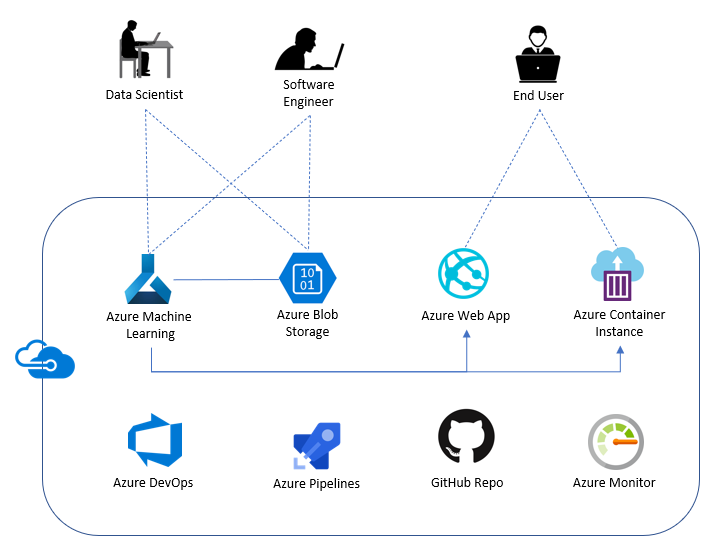
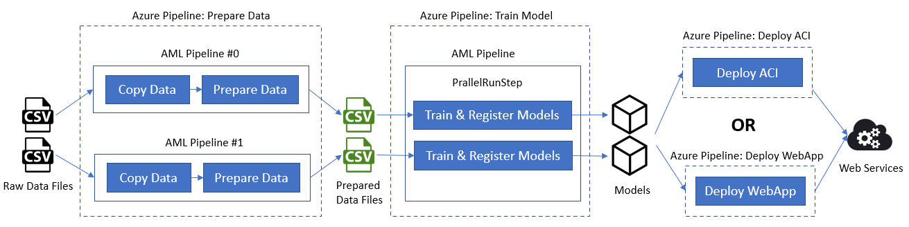

# Machine Learning DevOps for Many Models
This is a sample about how to implement pipelines for processing many machine learning models, including data preparation, model training and web service deployment.
## Background
We plan to train different models for the following use cases:
- [Forecast energy demand](https://github.com/Azure/MachineLearningNotebooks/tree/master/how-to-use-azureml/automated-machine-learning/forecasting-energy-demand)
  - Dataset: /data/nyc_energy.csv
- [Regression for diabetes](https://azure.microsoft.com/en-us/services/open-datasets/catalog/sample-diabetes/)
  - Dataset: /data/diabetes.csv

The following steps will be taken:
### Prepare data
- Copy data: the two datasets need to be copied from the original storage to the system defined Azure Blob Storage and container.
- Prepare data: filter out the unuseful columns from the original datasets.
### Train models
Train the two use case models in parallel, choose the best model and register them.
### Deploy models into ACI or Web App
- ACI (Azure Container Instance) deployment: package the models and deploy them into a single ACI
- Web App deployment: package the models and deploy them into a single Web App   
## System architecture
The system architecture is shown as below.

Figure 1. Architecture

The data scientists access Azure Machine Learning and Azure Blob Storage to do the experiments to prepare the data, train the models and test the model performance. 

The software engineers use Azure Machine Learning and Azure Blob Storage to extract the source code for data preparation and model training and build the MLOps pipelines to automate the whole process. This process is not only about preparing data and training models, but also include deploying models into Azure Web Apps or Azure Container Instances.

When the models are deployed, the end users can consume the models in real time, by sending requests to the URLs of the Azure Web Apps or Azure Container Instances.

Figure 2. Pipelines

As Figure 2 shows above, there are 3 Azure pipelines have been set:
- Prepare data pipeline: runs 2 AML pipelines in which contains two steps, 'Copy Data' and 'Prepare Data'.
- Train model pipeline: runs an AML pipeline which trains models in parallel by using ParallelRunStep
- Deploy ACI pipeline: package the models and deploy them into a single ACI
- Deploy WebApp pipeline: package the models and deploy them into a single Azure Web App
## Code description
### /.pipelines
Azure DevOps Pipelines
- ff-prepare-data.yml: copy data and filter out needed columns and save it to the target storage container and folder.
- ff-build-train.yml: train many models by using AutoML, choose and register the best models in parallel 
- ff-deploy-aci.yml: package many models into a single Azure Container Instance and deploy as a web serivce.
- ff-deploy-webapp.yml: : package many models into a single image which is deployed as an Azure Webapp

Variables are defined in:
- ff-variables.yml 
- Azure DevOps variable group: mmmo-vg

### /ff
Python scripts
- scoring/score.py
- util/helper.py
- ci_dependencies.yml
- conda_dependencies.yml
- copy_data.py
- pipeline_config.json： configuration for differnt use cases/models
- prepare.py
- train_automl.py

### /ml_service
Azure ML pipelines & tools
- pipelines/ff_build_train_pipeline.py
- pipelines/ff_run_train_pipeline.py
- pipelines/ff_deploy_aci_pipeline.py
- pipelines/ff_prepare_data_pipeline.py
- util/attach_compute.py
- util/env_variables.py
- util/ff_create_scoring_image.py : packing models into an image for Azure Webapp deployment
- util/ff_smoke_test_scoring_service.py
- util/tools.py

## Get Started
### Create a Variable Group for your Pipeline
Create a variable group 'mmmo-vg' with the following variables:
| Variable Name               | Suggested Value                    |
| --------------------------- | -----------------------------------|
| BASE_NAME                   | [unique base name]                 |
| LOCATION                    | [resrouce group location]          |
| RESOURCE_GROUP              | [your resource group name]         |
| WORKSPACE_NAME              | [your AML WS name]                 |
| WORKSPACE_SVC_CONNECTION    | aml-workspace-connection           | 
| ACI_DEPLOYMENT_NAME         | [your ACI name]                    |
| AZURE_RM_SVC_CONNECTION     | azure-resource-connection          |
| WEBAPP_DEPLOYMENT_NAME      | [your webapp name]                 |
| TRAIN_STORAGE_CONNECTION_STRING | [train storage connection string] |
| TRAIN_STORAGE_CONTAINER         | [train storage container]         |
| APPLICATIONINSIGHTS_CONNECTION_STRING | [applicationinsights connection string] |
### Create AZURE_RM_SVC_CONNECTION	
azure-resource-connection

### Create Resources with Azure Pipelines
Run /environment_setup/iac-create-environment.yml

### Create WORKSPACE_SVC_CONNECTION
Service connection for the machine learning workspace
aml-workspace-connection

### Create Docker Registry service connection
acrconnection

### Enter variables about train storage and application insights
Since we'll use the default storage and application insights provided by Azure Machine Learning Workspace, you need to find out and fill in the following variables for 'mmmo-vg':
- TRAIN_STORAGE_CONNECTION_STRING
- TRAIN_STORAGE_CONTAINER
- APPLICATIONINSIGHTS_CONNECTION_STRING

### Run Docker Image Pipeline
Run /environment_setup/docker-image-pipeline.yml

### Configure the Pipeline
Edit /ff/pipeline_config.json

### Run Build Train Pipeline
Run /.pipelines/ff-build-train.yml
ff-build-train.yml -> ff_build_train_pipeline.py & ff_run_train_pipeline.py -> train_automl.py

### Run Deploy ACI Pipeline
Run /.pipelines/ff-deploy-aci.yml
ff-deploy-aci.yml -> ff_deploy_aci_pipeline.py -> score.py

### Run Deploy Webapp Pipeline
Run /.pipelines/ff-deploy-webapp.yml
ff-deploy-webapp.yml -> ff_create_scoring_image.py -> score.py

### Consume Web Services
#### Using web browsers
- http://xxx.eastasia.azurecontainer.io/score?model_name=nyc_energy_model&data=[["2017-8-12 7:00",0,70],["2017-8-12 19:00",0,50]]
- http://xxx.eastasia.azurecontainer.io/score?model_name=diabetes_model&data=[[1,2,3,4,5,6,7,8,9,0],[56,33,11,88,0,43,6,8,1,68]]
#### Using Postman
- URL: https://your_webapp_name.azurewebsites.net/score
- Body-raw:
{
	"model_name": "nyc_energy_model",
    "data": [
        [
            "2017-08-13 06:00",
            0,
            50
        ]
    ]
}
#### Using Source code
- ml_service/util/ff_smoke_test_scoring_service.py

## References
[Official MLOps Python project](https://github.com/microsoft/MLOpsPython)